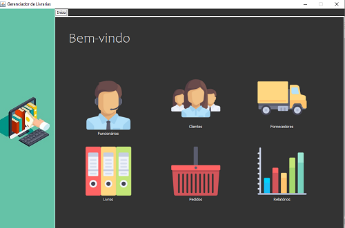
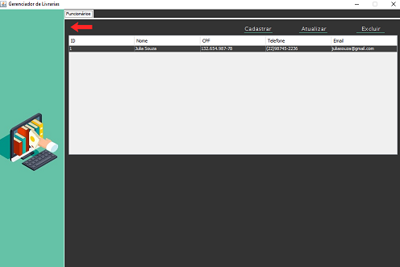
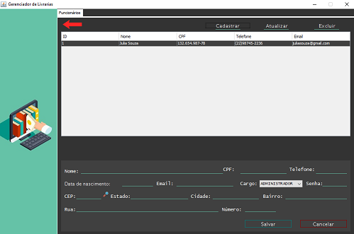
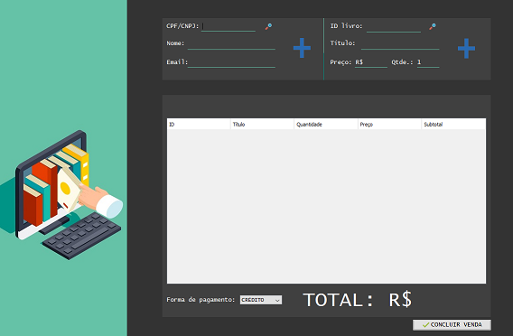

# GerenciadorDeLivrariasPDV

## 1. Resumo

  Trabalho em desenvolvimento, relacionado à conclusão da matéria de Programação Orientada a Objetos, utilizando Java Swing, iText e Banco de dados MySQL.
  
  Sistema básico de gerenciamento de uma livraria que permite restringir acesso, cadastrar, alterar e excluir clientes, funcionários, livros e pedidos. O sistema em 
  desenvolvimento permitirá a geração de relatórios para análise de dados, para gerar informação estratégica para tomadas de futuras decisões.

## 2. Telas do sistema

### 2.1. Tela de login

### 2.2. Tela principal

### 2.3. Tela de funcionários

#### 2.3.1. Tela de cadastro de funcionários

### 2.4. Tela cadastro de fornecedores

### 2.4. Tela cadastro de clientes física e jurídica

### 2.6. Tela do caixa

### 2.7.

### 2.8.
